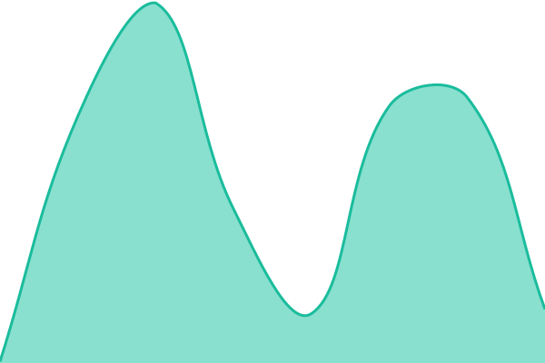
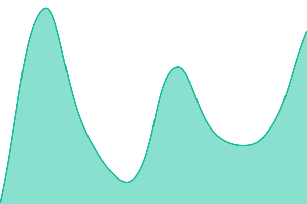
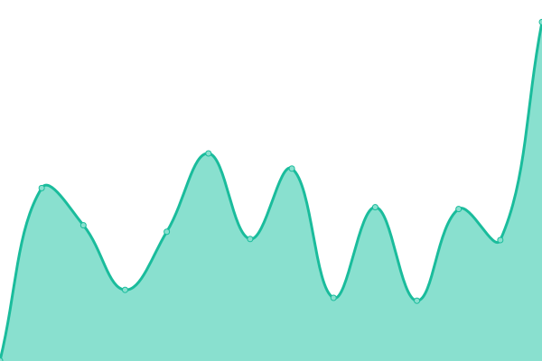
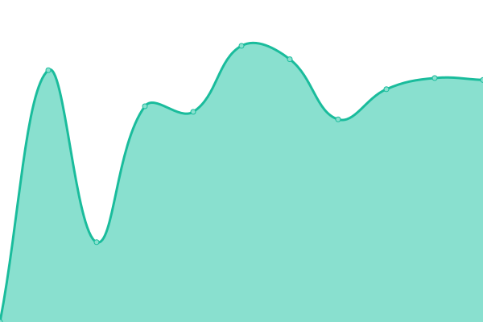

# [📈 Live Status](https://rickydev254.github.io/verixium-upptime): <!--live status--> **🟩 All systems operational**

This repository contains the open-source uptime monitor and status page for [Verixium](https://rickydev254.github.io/verixium-upptime), powered by [Upptime](https://github.com/upptime/upptime).

With [Upptime](https://upptime.js.org), you can get your own unlimited and free uptime monitor and status page, powered entirely by a GitHub repository. We use [Issues](https://github.com/rickydev254/verixium-upptime/issues) as incident reports, [Actions](https://github.com/rickydev254/verixium-upptime/actions) as uptime monitors, and [Pages](https://rickydev254.github.io/verixium-upptime) for the status page.

<!--start: status pages-->
<!-- This summary is generated by Upptime (https://github.com/upptime/upptime) -->
<!-- Do not edit this manually, your changes will be overwritten -->
<!-- prettier-ignore -->
| URL | Status | History | Response Time | Uptime |
| --- | ------ | ------- | ------------- | ------ |
|  [Komodo](https://komodo.verixium.com) | 🟩 Up | [komodo.yml](https://github.com/rickydev254/verixium-upptime/commits/HEAD/history/komodo.yml) | 

 353ms
     
 | 

<a href="https://rickydev254.github.io/verixium-upptime/history/komodo">100.00%</a>
    

|  [Komodo-Dev](https://komodo.verixium.qzz.io) | 🟩 Up | [komodo-dev.yml](https://github.com/rickydev254/verixium-upptime/commits/HEAD/history/komodo-dev.yml) | 

 2796ms
     
 | 

<a href="https://rickydev254.github.io/verixium-upptime/history/komodo-dev">100.00%</a>
    

|  [N8N](https://n8n.verixium.com) | 🟩 Up | [n8-n.yml](https://github.com/rickydev254/verixium-upptime/commits/HEAD/history/n8-n.yml) | 

 411ms
     
 | 

<a href="https://rickydev254.github.io/verixium-upptime/history/n8-n">100.00%</a>
    

|  [N8N-Dev](https://n8n.verixium.qzz.io) | 🟩 Up | [n8-n-dev.yml](https://github.com/rickydev254/verixium-upptime/commits/HEAD/history/n8-n-dev.yml) | 

 2765ms
     
 | 

<a href="https://rickydev254.github.io/verixium-upptime/history/n8-n-dev">100.00%</a>
    

|  [Zarban](https://zarban.verixium.com) | 🟩 Up | [zarban.yml](https://github.com/rickydev254/verixium-upptime/commits/HEAD/history/zarban.yml) | 

 446ms
     
 | 

<a href="https://rickydev254.github.io/verixium-upptime/history/zarban">95.08%</a>
    

|  [Care-Dev](https://care.verixium.qzz.io) | 🟩 Up | [care-dev.yml](https://github.com/rickydev254/verixium-upptime/commits/HEAD/history/care-dev.yml) | 

 2943ms
     
 | 

<a href="https://rickydev254.github.io/verixium-upptime/history/care-dev">99.18%</a>
    

|  [Sulami](https://sulami.verixium.com) | 🟩 Up | [sulami.yml](https://github.com/rickydev254/verixium-upptime/commits/HEAD/history/sulami.yml) | 

 2142ms
     
 | 

<a href="https://rickydev254.github.io/verixium-upptime/history/sulami">100.00%</a>
    

<!--end: status pages-->

[**Visit our status website →**](https://rickydev254.github.io/verixium-upptime)

## 📄 License

- Powered by: [Upptime](https://github.com/upptime/upptime)
- Code: [MIT](./LICENSE) © [Anand Chowdhary](https://anandchowdhary.com), supported by [Pabio](https://pabio.com)
- Data in the `./history` directory: [Open Database License](https://opendatacommons.org/licenses/odbl/1-0/)
