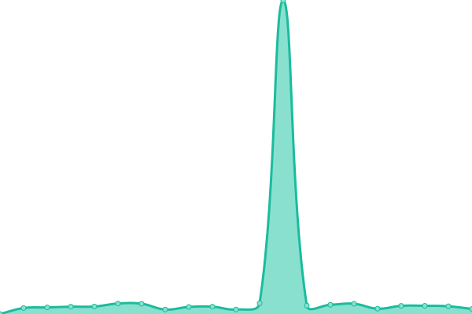
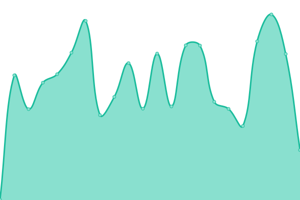

# [📈 Live Status](https://rickydev254.github.io/verixium-upptime): <!--live status--> **🟩 All systems operational**

This repository contains the open-source uptime monitor and status page for [Eric](https://rickydev254.github.io/verixium-upptime), powered by [Upptime](https://github.com/upptime/upptime).

With [Upptime](https://upptime.js.org), you can get your own unlimited and free uptime monitor and status page, powered entirely by a GitHub repository. We use [Issues](https://github.com/rickydev254/verixium-upptime/issues) as incident reports, [Actions](https://github.com/rickydev254/verixium-upptime/actions) as uptime monitors, and [Pages](https://rickydev254.github.io/verixium-upptime) for the status page.

<!--start: status pages-->
<!-- This summary is generated by Upptime (https://github.com/upptime/upptime) -->
<!-- Do not edit this manually, your changes will be overwritten -->
<!-- prettier-ignore -->
| URL | Status | History | Response Time | Uptime |
| --- | ------ | ------- | ------------- | ------ |
|  [Coolify](https://coolify.verixium.com) | 🟩 Up | [coolify.yml](https://github.com/rickydev254/verixium-upptime/commits/HEAD/history/coolify.yml) | 

 569ms
     
 | 

<a href="https://rickydev254.github.io/verixium-upptime/history/coolify">98.28%</a>
    

|  [Sulami](https://sulami.verixium.com) | 🟩 Up | [sulami.yml](https://github.com/rickydev254/verixium-upptime/commits/HEAD/history/sulami.yml) | 

 841ms
     
 | 

<a href="https://rickydev254.github.io/verixium-upptime/history/sulami">98.10%</a>
    

|  [Nexus](https://nexus.verixium.com) | 🟩 Up | [nexus.yml](https://github.com/rickydev254/verixium-upptime/commits/HEAD/history/nexus.yml) | 

 820ms
     
 | 

<a href="https://rickydev254.github.io/verixium-upptime/history/nexus">98.32%</a>
    

|  [Blog](https://blog.verixium.com) | 🟩 Up | [blog.yml](https://github.com/rickydev254/verixium-upptime/commits/HEAD/history/blog.yml) | 

 2801ms
     
 | 

<a href="https://rickydev254.github.io/verixium-upptime/history/blog">97.67%</a>
    

<!--end: status pages-->

[**Visit our status website →**](https://rickydev254.github.io/verixium-upptime)

## 📄 License

- Powered by: [Upptime](https://github.com/upptime/upptime)
- Code: [MIT](./LICENSE) © [Anand Chowdhary](https://anandchowdhary.com), supported by [Pabio](https://pabio.com)
- Data in the `./history` directory: [Open Database License](https://opendatacommons.org/licenses/odbl/1-0/)
